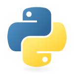

## Challenge Sprint 4 - Programa de Bolsas Compass

---------------------------------------------------
* Nesse Challenge vamos desenvolver habilidades de:

* Gerenciamento de Código

* Ferramentas para Gerenciamento de Código

* GIT e GITHUB

* Introdução e Sintaxe PYTHON

* Manipulação de dados com PYTHON

Por meio desse repositorio vamos realizar nossa challenge 
que consiste em, aprender a lidar da maneira correta com a ferramenta
GIT e com a plataforma do GITHUB, alem da resolucao de exercicios 
utilizando a linguagem de programacao PYTHON.

--------------------------------------------------------------------------
## Exercicios de logica de programacao e sintaxe

Nestes exercicos temos como objetivo treinar e fixar a ideia de como funciona 
o basico sobre logica de programacao na linguagem de programacao PYTHON trabalhando com
conceitos como:
* definicao de variaveis
* operadores aritimeticos
* condicionais
* loops 
* funcoes
  
A partir do material disponibilizado em nossa trilha de aprendizagem,
conseguimos conhecimento suficiente para resolver estes exercicos que estao 
desscritos em forma de comentario dentro de cada arquivo referente a sua atividade

---------------------------------------------------------------------------------

## Exercicios de manipulacao de arquivos em PYTHON

O obetivo dessa atividade foi treinar e fixar, a maneira como conseguimos
por meio da linguagem de programacao do Python interagir, manipular e ate mesmo criar
arquivos nos modelos:
* JSON
* CSV

Para isso aprendemos habilidades nescessarias como, a modelagem e formatacao
desse tipo de arquivo, alem do uso de ferramentas como o PANDAS.
Para cada exercio deste topico foi utilizado um arquvio JSON ou CSV de base,
todos eles podem ser encontrados no mesmo diretotio onde estao os exercicos, cujo 
os enunciados assim como no topico anterior estao descritos como comentario 
nas primeiras linhas de cada programa.

----------------------------------------------------------------

## GIT e GITHUB

Como objetivo dessa sprint, tambem tinhamos a apredizagem e familiarizacao 
com as ferramentas essenciais para qualquer um na area de trabalho de tcnologia.
Sendo ela o GIT e o GITHUB.
 
## GIT

O git consiste em uma ferramenta de versionamento de codigo, com uma arquitetura
DVCS (Sistema de Controle de Versão Distribuído),
a cópia de trabalho de todo desenvolvedor do código também é um repositório que pode conter o 
histórico completo de todas as alterações.

## GITHUB
O Github e um repositorio remoto, criado como um servico online de hospedagem 
de repositorios do GIT. 
Funciona como um servidor que agrega todas as modificacoes realizadas por cada uma das
pessoas envolvidas em um projeto, unficando as diferentes versoes de codigo e seus historicos,
permitindo compartilhamento entre as equipes
---------------------------------------------------------------------------------------------------
## Como baixar o repositorio para a sua maquina
Para fazer isto basta utilizar a funcionalidade clone do git
Sempre que você entrar em um repositório, seja o seu ou o de qualquer outra pessoa, 
terá esse botão Code, que quando você clica aparece um link
Você irá copiar esse link e levar ele lá pro nosso terminal

O comando para puxar o projeto para a sua máquina é o git clone 'Link'

Não é necessário criar um repositório antes disso, basta abrir o terminal e clonar o projeto e tudo aparecerá!

alem disso para rodar os programas basta ter o python e o pandas instalado em sua maquina

# Como Rodar

Abra o menu "Iniciar" Imagem intitulada Windowsstart. Para fazê-lo, clique no logo do Windows localizado no canto inferior esquerdo da tela. Em seguida, um pequeno menu vai aparecer.

Procure o "Prompt de comando". Para fazê-lo, digite cmd.

Clique  no topo do menu "Iniciar". Fazê-lo vai abrir o "Prompt de comando".

Altere o prompt para o diretório do arquivo Python. Para tanto, digite cd, dê um espaço, insira o endereço "Local" do arquivo Python e pressione a tecla ↵ Enter.
Por exemplo, para abrir um arquivo Python salvo na pasta "Arquivos" na área de trabalho, digite cd área de trabalho/Arquivos.
Caso tenha copiado o caminho do arquivo, digite cd, dê um espaço e pressione as teclas Ctrl+V.

Execute o comando "python" seguido do nome do arquivo. Digite python file.py onde "file" deve ser substituído pelo nome do arquivo
Por exemplo, digite python script.py para abrir um arquivo de nome python script.py.
Caso o arquivo tenha algum espaço no nome, digite-o entre aspas juntamente com a extensão (por exemplo: python "meu script.py").

Pressione a tecla ↵ Enter. Fazê-lo vai executar o comando e abrir o arquivo no aplicativo "Python" instalado no computador.

---------------------------------------------------------------------------------------------------------------
## Ferramentas utilizadas

    
 --------------------------------------------------------------------------------------------
## Creditos  e agradecimentos 
Silvioney Backes - https://github.com/neybackes

Anna Paula - https://github.com/annapaulamash

Rafaella Ballerini - https://github.com/rafaballerini

Além de todos os evagelistas que ajudaram no processo, e do material
disponibilizado pela compass

